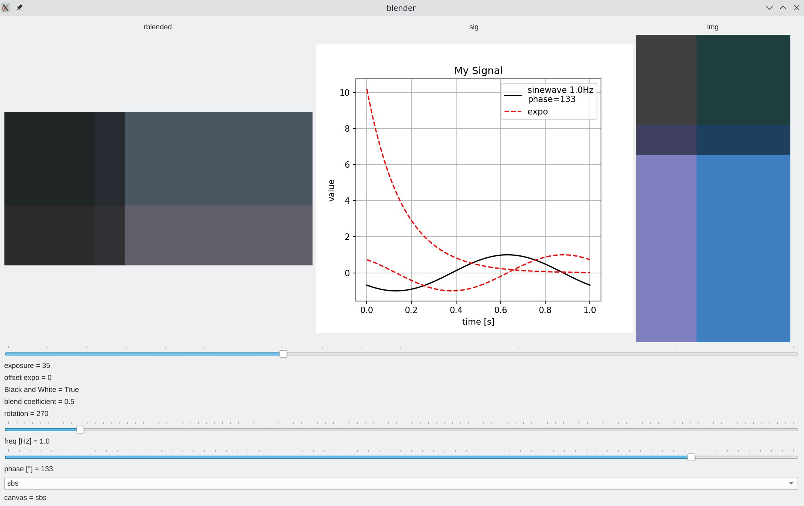
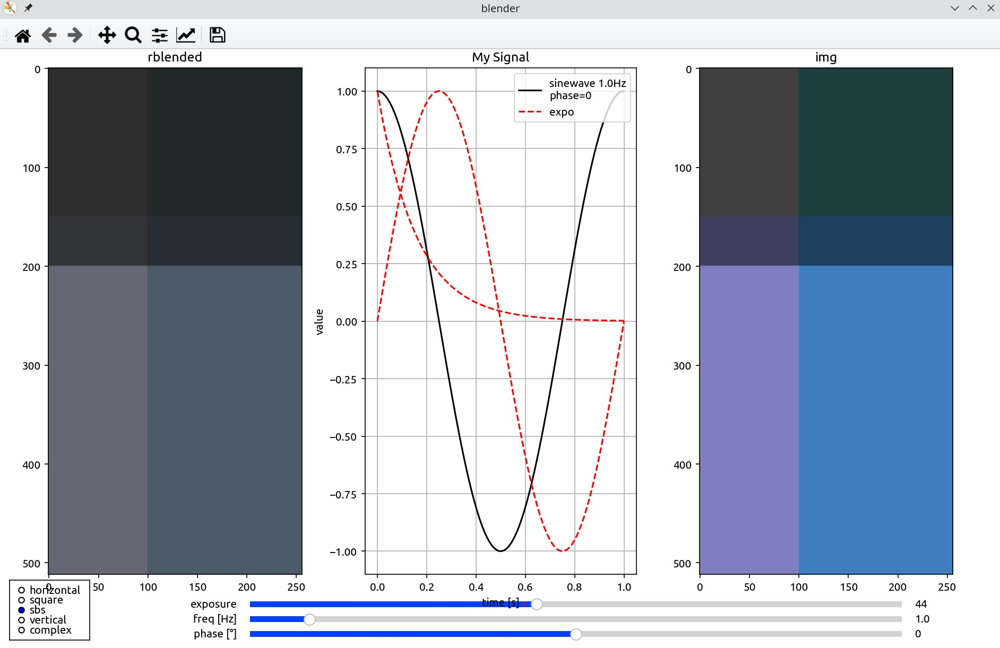
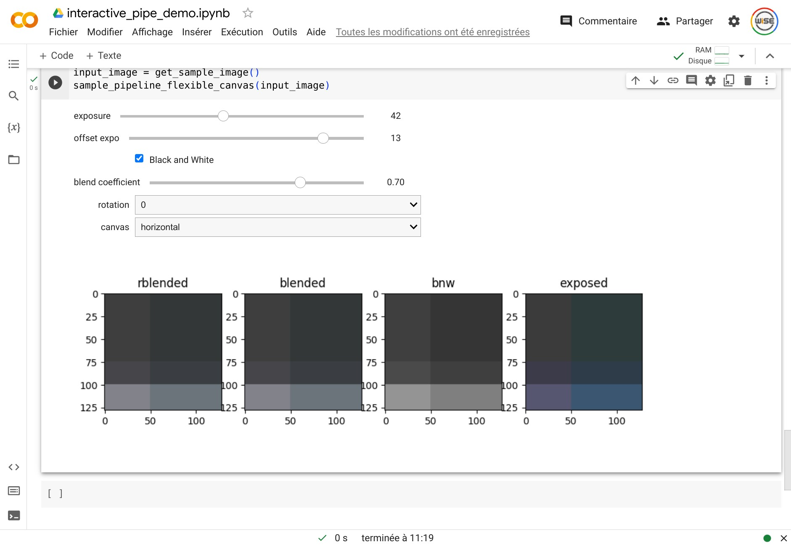
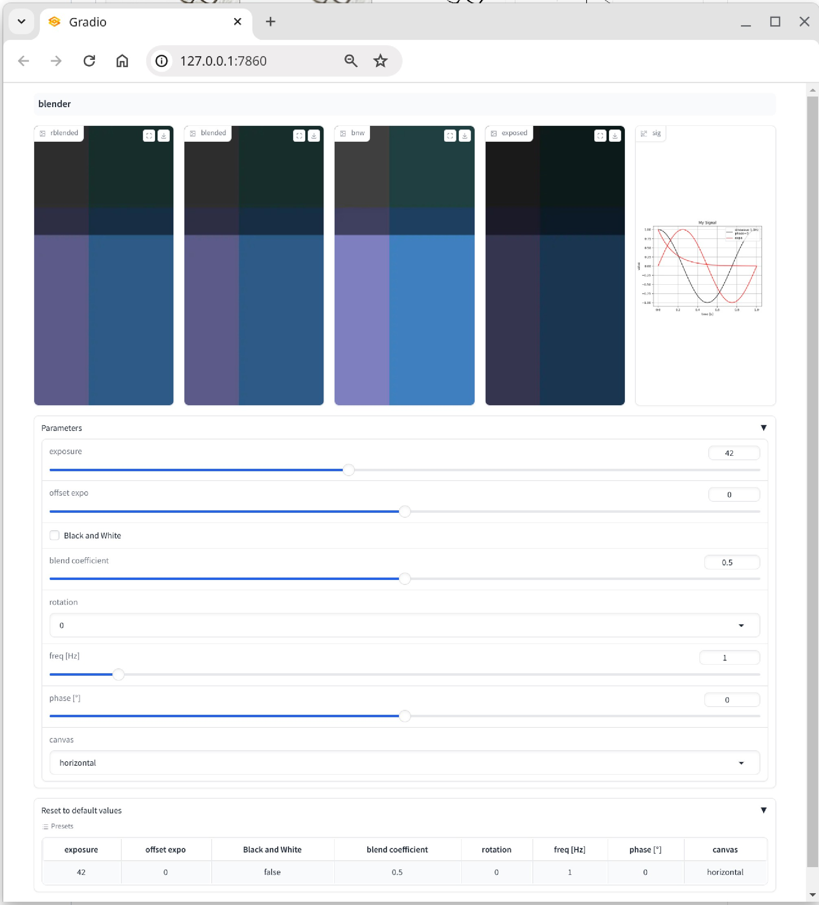

# Backends

Select the backend with the `gui=` argument of `@interactive_pipeline` (or `@interact`): a string, a `Backend` enum value, or `None` for headless mode.

```python
@interactive_pipeline(gui="qt")      # PyQt / PySide window
@interactive_pipeline(gui="mpl")     # matplotlib figure
@interactive_pipeline(gui="nb")      # Jupyter notebook widgets (works on Colab)
@interactive_pipeline(gui="gradio")  # web app (add share_gradio_app=True to share it)
@interactive_pipeline(gui="auto")    # best available backend
@interactive_pipeline(gui=None)      # headless: returns a HeadlessPipeline
```

## Feature matrix

| ⭐ | *PyQt / PySide* | *Matplotlib* | *Jupyter notebooks incl. Google Colab* | *Gradio* |
|:-----:|:-----:|:------:|:----:|:----:|
| Backend name | `qt` | `mpl` | `nb` | `gradio` |
| Preview |  |  |  |  |
| Plot curves | ✅ | ✅ | ✅ | ✅ |
| Change layout | ✅ | ✅ | ✅ | ➖ |
| Keyboard shortcuts / fullscreen | ✅ | ✅ | ➖ | ➖ |
| Audio support | ✅ | ➖ | ➖ | ✅ |
| Image buttons | ✅ | ➖ | ➖ | ➖ |
| Circular slider | ✅ | ➖ | ➖ | ➖ |
| Collapsible panels | ✅ | ➖ | ➖ | ✅ |
| Animations | ✅ | ➖ | ➖ | ➖ |
| Panels with sliders | ✅ | ➖ | ➖ | ✅ |
| Tables | ✅ | ✅ | ✅ | ✅ |

Controls degrade gracefully: for example a [`KeyboardControl`](../guide/keyboard.md) maps back to a regular slider on the gradio and notebook backends, and a `CircularControl` falls back to a straight slider outside Qt.

## Headless

`gui=None` (or `"headless"`) skips the GUI entirely and returns a `HeadlessPipeline`: the same pipeline code serves interactive tuning and batch processing, and it is what you want in unit tests. See the [Quickstart](quickstart.md#headless-mode-same-code-no-gui).
