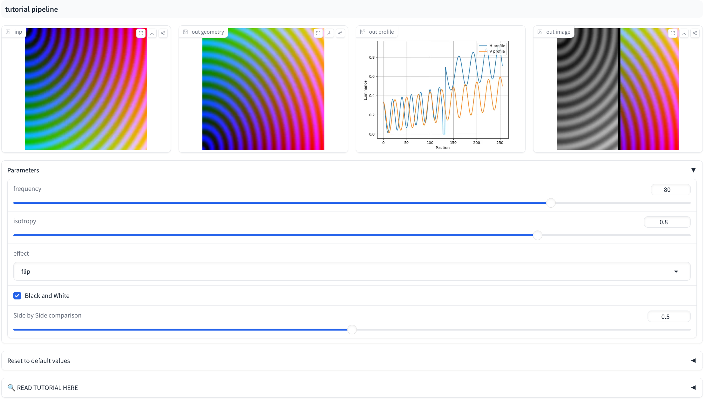
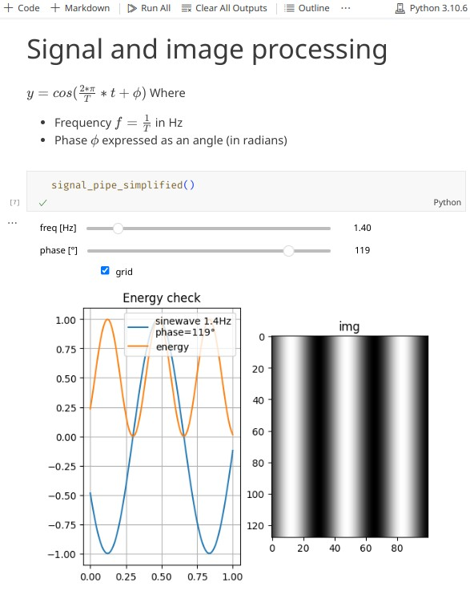
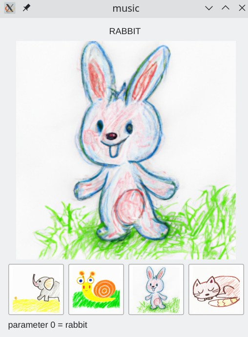
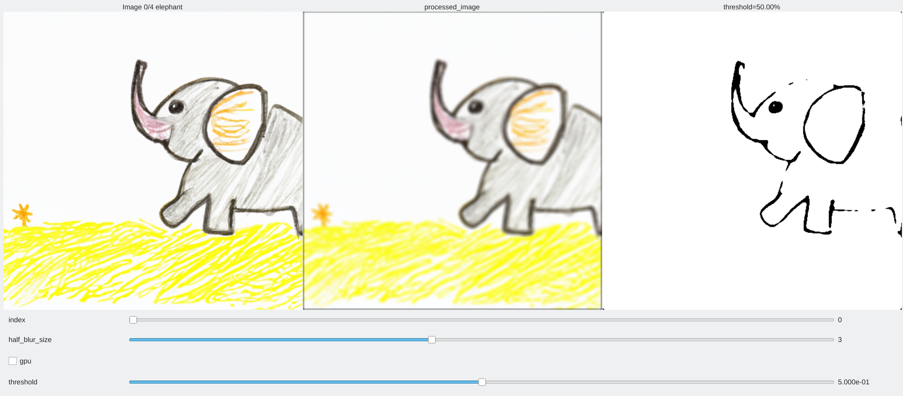
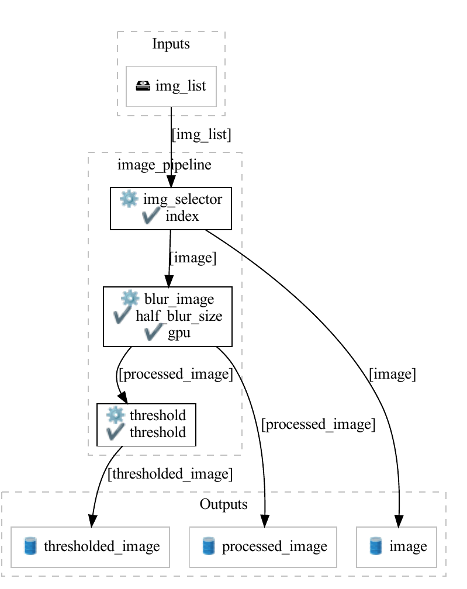

# Examples gallery

## Tutorials

- **[Main tutorial on Hugging Face](https://huggingface.co/spaces/balthou/interactive-pipe-tutorial)** — interactive, runs in the browser
- [Tutorial in a Colab notebook](https://colab.research.google.com/github/livalgo/interactive-pipe-examples/blob/main/interactive_pipe_tutorial.ipynb)
- [Quickstart as a Colab notebook](https://colab.research.google.com/drive/1PZn8P_5TABVCugT3IcLespvZG-gxnFbO?usp=sharing) (ipywidgets backend)
- [Speech exploration notebook](https://colab.research.google.com/drive/1mUX2FW0qflWn-v3nIx90P_KvRxnXlBpz#scrollTo=qDTaIwvaJQ6R) — signal processing in a notebook
- [Under the hood](https://colab.research.google.com/drive/1e4IB_jLGgGYonPXFuE9YdnaVNEC_1f19?usp=sharing) — build a pipeline graph object-style, without the decorators

## Showcase

| Science notebook | Toddler DIY jukebox on a Raspberry Pi |
|:-----:|:-----:|
|  |  |
| Sliders appear automatically in a Jupyter notebook — works on Google Colab, ~40 lines of code. | Plays music when a toddler touches an icon; image buttons + audio on Qt. |
| [Demo notebook on Colab](https://colab.research.google.com/drive/1AwHyjZH8MnzZqwsvbmxBoB15btuMIwtk?usp=sharing) | [jukebox_demo.py](https://github.com/balthazarneveu/interactive_pipe/blob/master/demo/jukebox_demo.py) |

### Multi-image pipeline

The main demo: [demo/multi_image.py](https://github.com/balthazarneveu/interactive_pipe/blob/master/demo/multi_image.py)

| GUI | Pipeline graph |
|:--:|:--:|
|  |  |

## Demo scripts

All in [`demo/`](https://github.com/balthazarneveu/interactive_pipe/tree/master/demo):

| Script | Shows |
|---|---|
| `multi_image.py` (+ `.ipynb`) | The main tutorial pipeline: selection, exposure, blending |
| `widgets_showcase.py` | Every widget type in one app |
| `button_demo.py` | Image buttons |
| `color_demo.py` | Dropdown-driven color generation |
| `colored_checkerboard_rotation_demo.py` | `CircularControl` rotation |
| `panel_demo.py` / `grouped_controls_demo.py` | [Panel system](panels.md) |
| `panel_position_demo.py` / `detached_panel_demo.py` | Panel placement and detached windows |
| `key_event_demo.py` | Key-bound one-shot [events](keyboard.md#key-bound-one-shot-events) |
| `time_wave_demo.py` / `time_physics_demo.py` | `TimeControl` animations |
| `image_editing_demo.py` / `image_analysis_demo.py` | Realistic image workflows |
| `independent_curve_image_demo.py` | Mixing `Curve` plots and images |
| `table_demo.py` | `Table` outputs |
| `jukebox_demo.py` | Raspberry Pi jukebox (audio + image buttons) |

## Curated samples

The [`samples/`](https://github.com/balthazarneveu/interactive_pipe/tree/master/samples) folder walks through the declaration styles:

- `decorated_pipeline.py` — decorator syntax with explicit `Control` objects
- `decorated_pipeline_abbreviated.py` — the [inline tuple shorthand](inline-syntax.md)
- `object_oriented_pipeline_declarations.py` — pipeline graph built by hand, no decorators
- `interact_sample/` — a small filter library + `@interact` one-shot GUI + its pytest suite
