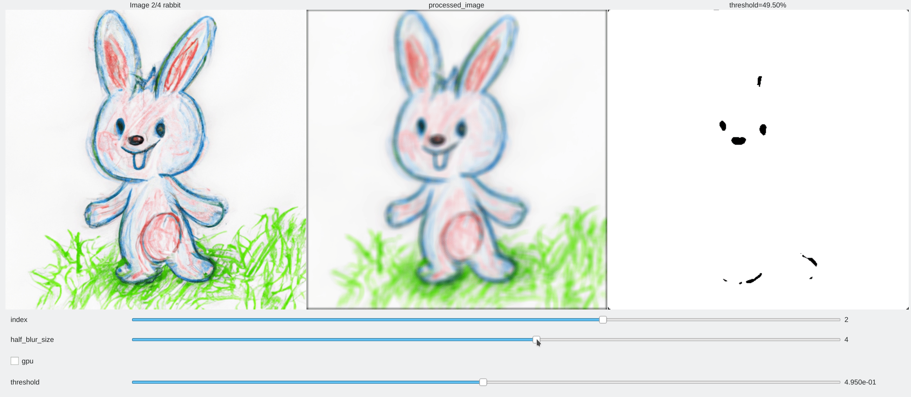

# interactive_pipe

**Turn plain python processing functions into an interactive GUI app — without writing a single line of GUI code.**

```
pip install interactive-pipe
```

- Develop an algorithm while debugging visually with plots, checking robustness and continuity to parameter changes.
- Magically create a graphical interface to demonstrate a concept or tune your algorithm.



## How it works

Decorate your processing functions with `@interactive()` to declare which keyword arguments become sliders, checkboxes or dropdowns. Chain them in a pipeline function decorated with `@interactive_pipeline(gui="qt")`. Calling the pipeline opens the GUI.

```python
from interactive_pipe import interactive, interactive_pipeline
import numpy as np

@interactive(coeff=(1.0, [0.5, 2.0], "exposure"))
def exposure(img, coeff=1.0):
    return img * coeff

@interactive_pipeline(gui="qt")
def my_pipeline(img):
    exposed = exposure(img)
    return exposed

my_pipeline(np.array([0.0, 0.5, 0.8]) * np.ones((256, 512, 3)))
```

Head to the [Quickstart](getting-started/quickstart.md) for the full walkthrough, or browse the [API reference](api/decorators.md).

## Who is this for?

**🎓 Scientific education**

- Demonstrate concepts by interacting with curves and images.
- Easy integration in Jupyter notebooks (works on Google Colab).

**🎁 DIY hobbyists**

- The declarative style makes a graphical interface in a few lines of code.
- For instance: a [jukebox for a toddler](https://github.com/balthazarneveu/interactive_pipe/blob/master/demo/jukebox_demo.py) on a Raspberry Pi.

**📷 Engineering (computer vision, image/signal processing)**

- Make small experiments with visual checks while prototyping an algorithm or testing a neural network — and share a demo anyone on your team can play with.
- Tune your algorithms with a GUI and save parameters for later batch processing.
- The processing engine also runs without a GUI (headless), so the same code serves tuning *and* batch processing.
- Keep your algorithm library untouched: interactivity is added by decoration, not by rewriting.

## Features

- Modular multi-image processing filters with a declarative GUI: sliders, checkboxes, dropdowns, text prompts, image buttons, circular sliders.
- Four backends: Qt, matplotlib, Jupyter widgets (`nb`), Gradio — plus headless mode ([backend matrix](getting-started/backends.md)).
- Caching of intermediate results in RAM for much faster interaction.
- [`KeyboardControl`](guide/keyboard.md): update values on key press instead of a slider.
- Curve plots (2D signals), [Table outputs](api/data-objects.md), audio support.
- [`TimeControl`](api/controls.md): play/pause an incrementing timer for animations.
- [Context API](guide/context-layout.md): share state across filters via the `context`, `layout`, `audio` and `events` proxies.
- [Panel system](guide/panels.md): group controls into nested, collapsible, detachable panels.
- MIT license.

## Agent-friendly docs

Coding agents can fetch the whole documentation in one shot:

- [`llms.txt`](https://balthazarneveu.github.io/interactive_pipe/llms.txt) — curated index
- [`llms-full.txt`](https://balthazarneveu.github.io/interactive_pipe/llms-full.txt) — full documentation, including the API reference
