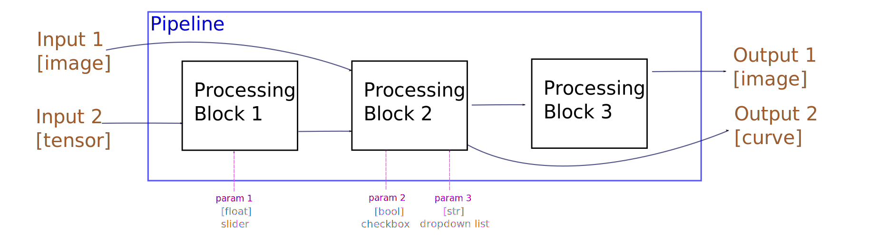

<center>

|  |
|:--:|
|Quick setup `pip install interactive-pipe` |
| [Project website](https://balthazarneveu.github.io/interactive_pipe/) |
|[](https://github.com/balthazarneveu/interactive_pipe/actions/workflows/pytest.yaml) |

</center>

# Interactive-pipe code
### Concept


- Develop an algorithm while debugging visually with plots, while checking robustness & continuity to parameters change.
- Magically create a graphical interface to easily demonstrate a concept or simply tune your algorithm.

:heart: **You do not need to learn anything about making a graphical user interface (GUI)** :heart:


### Examples


| Science notebook | Toddler DIY Jukebox on a raspberry Pi |
|:-----: |:-----:|
|  |  
| Sliders are added automatically in your jupyter notebook. This works on Google Collab and the code takes about 40 lines of code. No Widgets, event handlers or matplotlib knowledge required.| Plays some music when you touch the icon. Caption added through the title mechanism. Music samples generated by prompting [MusicGen](https://huggingface.co/spaces/facebook/MusicGen) |
| [Demo notebook on collab](https://colab.research.google.com/drive/1AwHyjZH8MnzZqwsvbmxBoB15btuMIwtk?usp=sharing) | [jukebox_demo.py demo code](/demo/jukebox_demo.py)|


----------------------

### Local setup
```
git clone git@github.com:balthazarneveu/interactive_pipe.git
cd interactive-pipe
pip install -e ".[full]"
```

----------------------

### Who is this for? 
#### :mortar_board: Scientific education
- Demonstrate concepts by interacting with curves / images.
- Easy integration in Jupyter Notebooks (popular with Google Collab) 
#### :gift: DIY hobbyist
- You can also use the declarative nature of interactive pipe to make a graphical interface in a few lines of codes. 
- For instance, it is possible to code a jukebox for a toddler on a RaspberryPi.
#### :camera: Engineering *(computer vision, image/signal processing)*
- While prototyping an algorithm or testing a neural network, you may be interested in making small experiments with visual checks. Instead of making a draft quick & dirty code that you'll never keep, you can use interactive pipe to show your team how your library works. A visual demo is always good, it shows that the algorithm is not buggy if anyone can play with it.
- Tune your algorithms with a graphical interface and save your parameters for later batch processing.
- Ready to batch under the hood, the processing engine can be ran without GUI (therefore allowing to use the same code for tuning & batch processing if needed).
- Do not spoil your production code with a huge amount of graphical interface code, keep your algorithms library untouched and simply decorate it.


----------------------
## :scroll:  Terminology



## :scroll:  Features

**Version 0.8.8**
- Modular multi-image processing filters
- Declarative: Easily make graphical user interface without having to learn anything about pyQt or matplotlib
- Support in jupyter notebooks
- Tuning sliders & check buttons  with a GUI
- Cache intermediate results in RAM for much faster processing
- `KeyboardControl` : no slider on UI but exactly the same internal mechanism, update on key press.
- Support Curve plots (2D signals)
- Gradio backend (+allows sharing with others). 
- Audio support in Gradio (live audio or display several players by returning 1D numpy arrays)
- Circular sliders for Qt Backend
- Text prompt (`free_text=("Hello world!", None),`)
- TimeControl (possibility to play/pause time using an incrementing timer)
- :new: **Context API**: Direct access to shared context across filters via `get_context()`, `context`, `layout`, `audio` 
- :new: MIT License


#### :keyboard:   Keyboard shortcuts
Shortcuts while using the GUI (QT & matplotlib backends)

- `F1` to show the help shortcuts in the terminal
- `F11` toggle fullscreen mode
- `W` to write full resolution image to disk
- `R` to reset parameters
- `I` to print parameters dictionary in the command line
- `E` to export parameters dictionary to a yaml file
- `O` to import parameters dictionary from a yaml file (sliders will update)
- `G` to export a pipeline diagram for your interactive pipe (requires graphviz)


# Status
- supported backends 
    - :ok: `gui='qt'` pyQt/pySide 
    - :ok: `gui='mpl'` matplotlib
    - :ok: `gui='nb'`  ipywidget for jupyter notebooks
    - :test_tube: `gui='gradio'` gradio wrapping (+use `share_gradio_app=True` to share your app with others)
- tested platforms
    - :ok: Linux (Ubuntu / KDE Neon)
    - :ok: RapsberryPi
    - :ok: On google collab (use `gui='nb'`)


| :star: | *PyQt / PySide* |  *Matplotlib*   | *Jupyter notebooks including Google collab*   | *Gradio* | 
|:-----: |:-----:|:------:|:----: |:----: |
| Backend name | `qt`  | `mpl`  | `nb`| `gradio` |
| Preview |    |     |    | | 
| Plot curves | :heavy_check_mark: | :heavy_check_mark: |   :heavy_check_mark: | :heavy_check_mark:|
| Auto refreshed layout | :heavy_check_mark: | :heavy_check_mark: |   :heavy_check_mark: | :heavy_minus_sign: |
| Keyboard shortcuts / fullscreen| :heavy_check_mark: | :heavy_check_mark: |  :heavy_minus_sign: | :heavy_minus_sign: |
| Audio support | :heavy_check_mark: | :heavy_minus_sign: |  :heavy_minus_sign: | :heavy_check_mark: |
| Image buttons| :heavy_check_mark: | :heavy_minus_sign: |  :heavy_minus_sign: | :heavy_minus_sign:| 
| Circular slider| :heavy_check_mark: | :heavy_minus_sign: |  :heavy_minus_sign: | :heavy_minus_sign:| 


# Tutorials
### [Main tutorial](https://huggingface.co/spaces/balthou/interactive-pipe-tutorial)


[Tutorial on Hugging Face space](https://huggingface.co/spaces/balthou/interactive-pipe-tutorial)


[Tutorial in a Colab notebook](https://colab.research.google.com/github/livalgo/interactive-pipe-examples/blob/main/interactive_pipe_tutorial.ipynb#scrollTo=U38Oh7coVKwf)

### Learn by examples
#### [Basic image processing (python code sample for PyQT GUI)](/demo/multi_image.py)
| GUI | Pipeline | 
|:--:|:--:| 
| |  |


#### [Speech exploration notebook (colab, signal processing)](https://colab.research.google.com/drive/1mUX2FW0qflWn-v3nIx90P_KvRxnXlBpz#scrollTo=qDTaIwvaJQ6R)


## :rocket: Ultra short code


*Since ipywidgets in notebooks are supported, the tutorial is also available in a [google collab notebook](https://colab.research.google.com/drive/1PZn8P_5TABVCugT3IcLespvZG-gxnFbO?usp=sharing)*


Let's define 3 image processing very basic filters `exposure`, `black_and_white` & `blend`.

By design:
- image buffers inputs are arguments
- keyword arguments are the parameters which can be later turned into interactive widgets.
- output buffers are simply returned like you'd do in a regular function.

We use the `@interactive()` wrapper which will turn each keyword parameters initialized to a **tuple/list** into a graphical interactive widgets (slider, tick box, dropdown men). 

The syntax to turn keyword arguments into sliders is pretty simple `(default, [min, max], name)` will turn into a float slider for instance.

Finally, we need to the glue to combo these filters. This is where the sample_pipeline function comes in.

By decorating it with `@interactive_pipeline(gui="qt")`, calling this function will magically turn into a GUI powered image processing pipeline.


```python
from interactive_pipe import interactive, interactive_pipeline
import numpy as np

@interactive()
def exposure(img, coeff = (1., [0.5, 2.], "exposure"), bias=(0., [-0.2, 0.2])):
    '''Applies a multiplication by coeff & adds a constant bias to the image'''
    # In the GUI, the coeff will be labelled as "exposure". 
    # As the default tuple provided to bias does not end up with a string, 
    # the widget label will be "bias", simply named after the keyword arg. 
    return img*coeff + bias


@interactive()
def black_and_white(img, bnw=(True, "black and white")):
    '''Averages the 3 color channels (Black & White) if bnw=True
    '''
    # Special mention for booleans: using a tuple like (True,) allows creating the tick box.
    return np.repeat(np.expand_dims(np.average(img, axis=-1), -1), img.shape[-1], axis=-1) if bnw else img

@interactive()
def blend(img0, img1, blend_coeff=(0.5, [0., 1.])):
    '''Blends between two image. 
    - when blend_coeff=0 -> image 0  [slider to the left ] 
    - when blend_coeff=1 -> image 1   [slider to the right] 
    '''
    return  (1-blend_coeff)*img0+ blend_coeff*img1

# you can change the backend to mpl instead of Qt here.
@interactive_pipeline(gui="qt", size="fullscreen")
def sample_pipeline(input_image):
    exposed = exposure(input_image)
    bnw_image = black_and_white(input_image)
    blended  = blend(exposed, bnw_image)
    return exposed, blended, bnw_image

if __name__ == '__main__':
    input_image = np.array([0., 0.5, 0.8])*np.ones((256, 512, 3))
    sample_pipeline(input_image)

```
:heart: This code shall display you a GUI with three images. The middle one is the result of the blend


Notes:
- If you write `def blend(img0, img1, blend_coeff=0.5):`, blend_coeff will simply not be a slider on the GUI no more.
- If you write `blend_coeff=[0., 1.]` , blend_coeff will be a slider initalized to 0.5
- If you write `bnw=(True, "black and white", "k")`, the checkbox will disappear and be replaced by a keypress event (press `k` to enable/disable black & white)

-----------
## :bulb: Some more tips

```python
from interactive_pipe import interactive, interactive_pipeline
import numpy as np

COLOR_DICT = {"red": [1., 0., 0.],  "green": [0., 1.,0.], "blue": [0., 0., 1.], "gray": [0.5, 0.5, 0.5]}
@interactive()
def generate_flat_colored_image(color_choice=["red", "green", "blue", "gray"], context={}):
    '''Generate a constant colorful image
    '''
    flat_array =  np.array(COLOR_DICT.get(color_choice)) * np.ones((64, 64, 3))
    context["avg"] = np.average(flat_array)
    return flat_array
```

- Note that you can also create filters which take no inputs and simply "generate" images. 
- The `color_choice` list will be turned into a nice dropdown menu. Default value here will be red as this is the first element of the list!
----------

:bulb: Can filters communicate together?
Yes, using the special keyword argument `context={}`. 
- Check carefully how we stored the image average of the flat image in  context. 
- This value will be available to other filters.
`special_image_slice` is going to use that value to set the half bottom image to dark in case the average is high.

```python
@interactive()
def special_image_slice(img, context={}):
    if context["avg"] > 0.4:
        out_img[out_img.shape[0]//2:, ...] = 0.
    return out_img
```
---


```python
@interactive()
def switch_image(img1, img2, img3, image_index=(0, [0, 2], None, ["pagedown", "pageup", True])):
    '''Switch between 3 images
    '''
    return [img1, img2, img3][image_index]
```
Note that you can create a filter to switch between several images. In `["pagedown", "pageup", True]`, True means that the image_index will wrap around. (it will return to 0 as soon as it goes above the maximum value of 2).

```python
@interactive()
def black_top_image_slice(img, top_slice_black=(True, "special", "k"), context={}):
    out_img = img.copy()
    if top_slice_black:
        out_img[:out_img.shape[0]//2, ...] = 0.
    return out_img


@interactive_pipeline(gui="qt", size="fullscreen")
def sample_pipeline_generated_image():
    flat_img = generate_flat_colored_image()
    top_slice_modified = black_top_image_slice(flat_img)
    bottom_slice_modified_image = special_image_slice(flat_img)
    chosen = switch_image(flat_img, top_slice_modified, bottom_slice_modified_image)
    return chosen

if __name__ == '__main__':
    sample_pipeline_generated_image()
```

----------

### Release Notes

#### Version 0.8.8 (January 2026)

**New Features:**
- **Clean Context API**: Access shared context directly without `global_params` pollution
  - `get_context()` - Get the shared context dictionary
  - `context` - Direct dict-like access to context
  - `layout` - Access layout configuration directly
  - `audio` - Access audio functionality directly

**Code Quality Improvements:**
- Replaced all assertions with proper exceptions (`ValueError`, `TypeError`, `RuntimeError`)
- Fixed all mutable default arguments across the codebase (prevents shared state bugs)
- Improved type hints with proper `Optional` and `Any` types
- Better error messages for debugging

**UX Improvements:**
- Dropdown menus are now hidden when only a single choice is available
- Helpful message displayed when Graphviz is not available (when pressing `G`)
- Fixed warning in linestyle for curves

**Bug Fixes:**
- Fixed audio initialization order in Qt backend
- Fixed pytest failures for optional dependencies in CI
- Fixed various edge cases in error handling

**Migration of old context or global_params:**  
- Use `global_params=SharedContext.injected()` to let code interpreters know that there's no need to pass this parameter.

```python
# Before
def apply_brightness(img:np.ndarray, brightness: float = 0.5, global_params:dict =None):
    global_params["brightness"] = brightness
    return img * brightness

# Progressive migration
def apply_brightness(img:np.ndarray, brightness: float = 0.5, global_params:dict ==SharedContext.injected()):
    global_params["brightness"] = brightness
    return img * brightness

# Recommended version
from interactive_pipe import context
def apply_brightness(img:np.ndarray, brightness: float = 0.5):
    context.shared_brightness = brightness # shared with all filters
    return img * brightness
```


**License:**
- Updated to MIT License

---

### History
- Interactive pipe was initially developed by [Balthazar Neveu](https://github.com/balthazarneveu) as part of the [irdrone project](https://github.com/wisescootering/infrareddrone/tree/master/interactive) based on matplotlib.
- Later, more contributions were also made by [Giuseppe Moschetti](https://github.com/g-moschetti) and Sylvain Leroy.
- August 2023: rewriting the whole core and supporting several graphical backends!
- September 2024: Gradio backend
- January 2026: Clean Context API and code quality improvements (v0.8.8)


### FAQ
- :question: What is the recommended way to access shared context?
> **New in v0.8.8**: Use the clean context API for direct access:
> ```python
> from interactive_pipe import context, layout, audio, get_context
> 
> @interactive()
> def my_filter(img):
>     context["shared_key"] = "shared_value"  # Direct dict-like access
>     context.brightness = 0.5
>     layout.set_title("output_image", "My Image")  # Layout helpers
>
>     return img
> ```

- :question: How do I change the layout?  *Can I change the grid layout of images live? (like you compare 2 images side by side and you want to start comparing 4 images in a 2x2 fashion for debugging purpose)*. It is possible with Qt backend. 

> Use the `layout` helper to control image arrangement and styling:
> ```python
> from interactive_pipe import layout
> 
> def change_layout(layout: str="side_by_side"):
>     # Arrange outputs in a 2x2 grid
>       if layout == "side_by_side":
>            layout.grid([["input", "result"]])
>       if layout == "grid2x2":
>           layout.grid([["input", "processed"], ["histogram_graph", "result"]])
>     # Style individual outputs
>     layout.style("result", title="Final Result")
>     # Note that the string "input", "processed", "histogram_graph", "result"
>     # are the variables used in the pipeline (see below)!
> 
> def pipeline(input):
>     processed = denoise(input)
>     result = change_brightness(processed)
>     histogram_graph = compute_histo(processed)
>     change_layout()
>     return result
> ```

- :question: Do I have to remove `KeyboardSlider` when using gradio or notebook backends?
> No, don't worry, these will be mapped back to regular sliders!
- :question: How do I play audio live?
> :sound: Inside a processing block, write the audio file to disk and use the audio helper:
> ```python
> from interactive_pipe import audio
> audio.set_audio(audio_file)  # New clean API (v0.8.8)
> # or legacy: context["__set_audio"](audio_file)
> ```
- :question: Do I have to decorate my processing block using the `@interactive` 
> If you use the `@` decoration style, your function won't be useable in a regular manner (wich may be problematic in a serious development environment)
```python
@interactive(angle=(0., [-360., 360.]))
def processing_block(angle=0.):
    ...
```

> An alternative is to decorate the processing block outside... in a file dedicated to interactivity for instance
```python
# core_filter.py
def processing_block(angle=0.):
    ...
```

```python
# graphical.py
from core_filter import processing_block

def add_interactivity():
    interactive(angle=(0., [-360., 360.]))(processing_block)
```
- :question: Can I call the pipeline in a command line/batch fashion?
> Yes, headless mode is supported. :soon: documentation needed.


- :question: Can I use inplace operations?
> Better avoid these in general. To avoid making extra copies, computing hashes everywhere and avoid loosing precious computation time, there are no checks that inputs are not modified in place.
```python
# Don't do that!
def bad_processing_block(inp):
    inp+=1
```

- :question: Is there a difference between `global_params` and `context` ?
> No, `global_params`, `global_parameters`, `global_state`, `global_context`, `context`, `state` all mean the same thing and are all supported for legacy reasons. `context` is the preferred wording. However, we now recommend using the clean context API (see above).
> :warning: The old `global_params={}` / `context={}` keyword argument style still works for backwards compatibility but is deprecated.


# Roadmap and todos
:bug: Want to contribute or interested in adding new features? Enter a new [Github issue](https://github.com/balthazarneveu/interactive_pipe/issues)

:gift: Want to dig into the code? Take a look at [code_architecture.md](/code_architecture.md)

## Short term roadmap
- Backport previous features
    - Image class support in interactive pipe (Heatmaps/Float images)

## Long term roadmap
- Advanced feature
    - Webcam based "slider" for dropdown menu (like "elephant" will trigget if an elephant is magically detected on the webcam)
    - Animations/While loops/Video source (Time slider)
- Exploratory backends
    - Create a [textual](https://github.com/Textualize/textual) backend for simplified GUI (probably no images displayed)
    - Create a [Kivy](https://kivy.org/) backend


### Further examples

#### [Minimalistic pytorch based ISP ](https://github.com/balthazarneveu/interactive_pipe/tree/sample_interactive_isp/samples/isp)
[ISP means image signal processor](https://en.wikipedia.org/wiki/Image_processor)

:warning: Work in progess (no proper demosaicking, no denoiser, no tone mapping.)


----------------------

### Development

#### Code quality checks

Before committing, ensure your code passes the linters and tests. The CI runs these checks automatically:

**What CI does:**
- **Black formatting check** (`.github/workflows/formatting.yaml`): Runs `black --check` to verify code formatting
- **Flake8 linting** (`.github/workflows/flake8.yaml`): Runs `flake8` to check code quality
- **Pytest tests** (`.github/workflows/pytest.yaml`): Runs `pytest` on Python 3.9, 3.10, and 3.11

**Local commands (match CI):**

```bash
# Install linting tools and test dependencies
pip install black flake8
pip install -e ".[pytest]"

# Check code formatting (Black) - matches CI
black --check .

# Auto-format code (Black) - run this if check fails
black .

# Run linting checks (flake8) - matches CI
flake8 .

# Run tests (pytest) - matches CI
pytest
```

